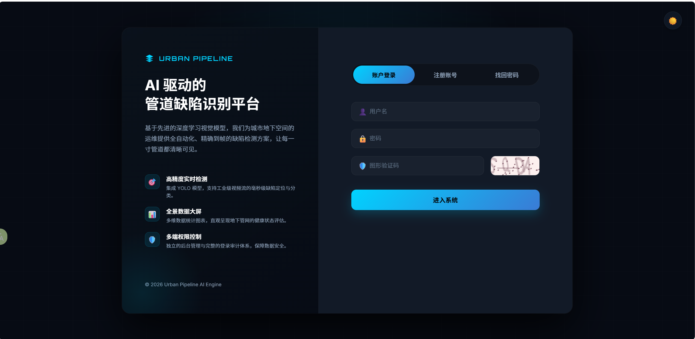
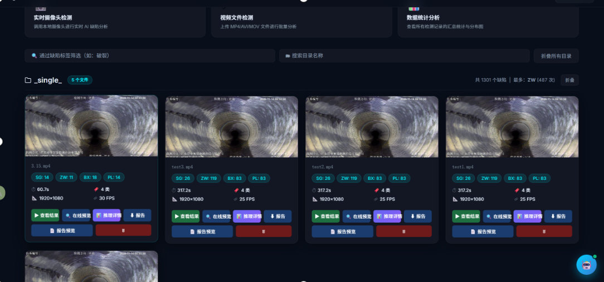
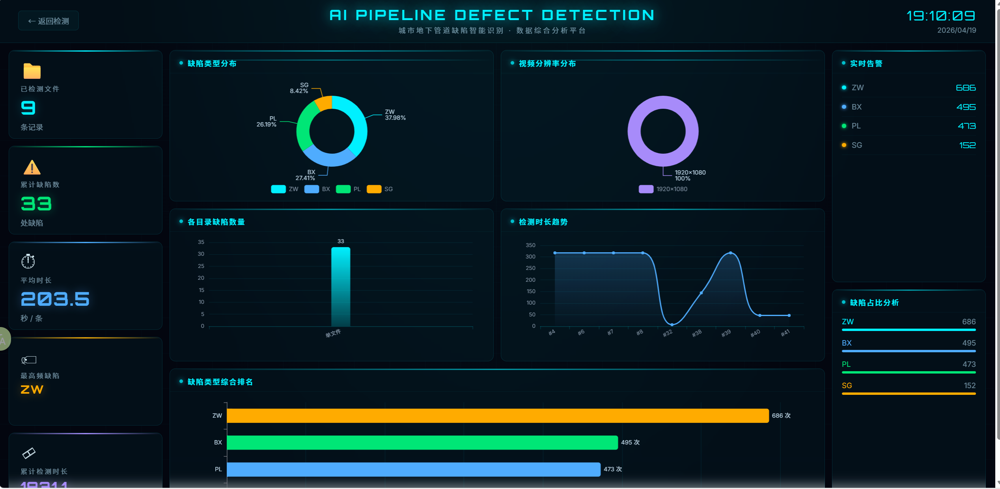

# 城市管网缺陷智能检测平台 (Urban Pipeline AI Detection)

本项目是一个基于 Flask 和 YOLO 构建的工业级城市管网缺陷智能检测和管理平台。集成了图像/视频目标检测、后台数据大屏可视化分析、设备与用户系统管理，并通过大语言模型 (LLM) 提供了专门优化过的“管网助手” AI Agent 智能交互能力。

## 代码
[点此跳转](https://drive.google.com/drive/folders/146OLBqSXTINd1SA3ybxMlF_oRuCZ_RNz?usp=drive_link)

## 🌟 核心特性展示

以下是本系统的部分功能界面截图：

### 1. 登录页面
安全的系统入口，支持账号注册、登录以及动态图形验证码：


### 2. 缺陷检测主页面
可视化的城市管网视频流与图片缺陷检测终端，基于深度学习 YOLO 架构提供高精度识别能力：


### 3. 数据大屏
实时呈现管网设备数据、缺陷统计、在线态势感知等信息的管理图表仪表盘：


---

## 🏗️ 核心技术栈架构详解

系统在设计与实现上融合了丰富的全栈开发、人工智能以及跨维度数据处理工具。具体包含：

- **核心后端服务与 API 架构**:
  - `Python 3.10+`: 坚实的后端运行基础。
  - `Flask` 系列 (`Flask 3.0+`, `Flask-Cors`, `Flask-SQLAlchemy`, `Flask-Migrate`): 支撑轻量灵活的路由、状态管理、ORM 映射及跨域处理。

- **AI 大模型与智能体应用 (LLM Agent)**:
  - `LangChain`: 复杂 prompt 调度和智能代理流的核心引擎。
  - **模型协议扩展**: 依托 `OpenAI API` 标准结构，可零成本秒切支持 `DeepSeek`、`ChatGPT`、本地化 `Ollama` 部署的大语言模型。

- **计算机视觉与高并发推理 (CV)**:
  - `Ultralytics YOLO` (包含特定优化的 YOLO 模型): 支持高帧流畅渲染的管网缺陷追踪与实时侦测 (`track` 模块)。
  - `PyTorch` 及其生态体系 (`torch`, `torchvision`, `timm` 等): 为深度学习提供底层张量计算支持。
  - `ONNXRuntime-GPU`: 进行生产级的跨平台推理加速任务。
  - `OpenCV-Python` & `Pillow` & `scikit-image`: 解析视频切片媒体流以及逐帧图像渲染。
  - 计算支持库：`efficientnet-pytorch`、`einops`、`thop`(查算力和参数量)、`PyWavelets` 等。

- **科学计算引擎与统计绘图**:
  - `Pandas`, `NumPy`, `Scikit-learn`: 处理高度结构化的管网指标化数据并提供回归聚类等算法支持。
  - `Matplotlib`, `Seaborn`: 内置对训练曲线和部分可视化数据报表的高质量渲染。

- **数据持久化与访问**:
  - `MySQL 8.x` & `PyMySQL`: 工业级的业务系统数据持久存储。
  
- **前端模块与视窗展示生态**:
  - `Vue.js`: 缺陷检测平台终端的组件化数据响应式交互界面。
  - `HTML5` + Vanilla `CSS/JS`: 无框架阻碍搭载原生可视化数据大屏，高度兼容视频多路并发网络推送技术（涵盖 `MJPEG` 推流、`FFmpeg` 和 `cv2` 重编码后输出的 `H.264 MP4` 视频）。

- **周边工程化管理与插件**:
  - `uv`: 当前领先的、编译级的极速 Python 环境与包资源管理器。
  - `python-docx`: 基于缺陷识别轨迹，动态并自动化组装生成标准的 `.docx` 工单级检测报告文档。
  - `captcha` & `cryptography`: 用户核心鉴权保护、动态免刷新图形验证码以及密码散列哈希。
  - `Loguru`, `tqdm`, `psutil`: 完善健壮的工程流水线日志跟踪、终端任务实时进度条和操作系统资源占用审计。

---

## 📂 项目文件目录树

```text
test_ui/
├── picture/                     # README 系统运行截图文件夹
│   ├── 数据大屏.png
│   ├── 登录页面.png
│   └── 缺陷检测主页面.png
├── Urban_Pipeline__1/           # 项目主控服务与核心代码库
│   ├── app.py                   # Flask 后端核心启动文件（包含路由、数据库初始化、视频流处理）
│   ├── ai_agent.py              # LangChain 驱动的大模型智能体模块
│   ├── query_db.py              # 数据库查询服务与处理工具
│   ├── request.py               # 封装外部请求处理接口
│   ├── best.pt                  # YOLO 训练好的管网缺陷识别权重文件
│   ├── install_mysql.sh         # MySQL 数据库一件部署脚本
│   ├── pyproject.toml / uv.lock # uv Python 依赖配置文件
│   ├── .env.example             # AI 模型环境变量示例配置文件
│   ├── .webui_secret_key        # WebUI 后台密钥配置
│   ├── main_front/              # Vue 前端模块代码目录
│   ├── templates/               # Flask Web HTML 模板文件库
│   ├── static/                  # 静态资源存放路径 (CSS, JS, 字体库)
│   ├── uploads/                 # 用户上传的待检测原始图片/视频存储路径
│   └── processed/               # 检测处理后的图片/视频输出结果保存路径
└── yolo/                        # YOLO 相关的训练以及测试脚本等目录
```

---

## ⚙️ 环境配置指南

在首次运行本项目前，您需要完成以下数据库与 AI 配置操作。

### 1. 数据库配置 (MySQL)

项目主要依赖 MySQL 数据库。在启动服务时，后端程序(`app.py`)会自动连接数据库进行表结构迁移、创建 `Ai_detect` 库并生成默认的管理员账号。

**默认连接配置**：
- 主机 (Host): `localhost`
- 用户 (User): `root`
- 密码 (Password): `admin123`

如果你处于刚配置的 Linux/macOS 环境，可以通过执行项目内的安装脚本搭建数据库环境：
```bash
bash Urban_Pipeline__1/install_mysql.sh
```

如需使用自定义的数据库账号密码，请前往 `Urban_Pipeline__1/app.py` 中找到 `MYSQL_CONFIG` 并修改连接参数。
**默认初始管理员账号**：`admin` / `admin123`。

### 2. AI-Agent 模型配置 (`.env`)

为了顺畅体验平台自带的智能体交互功能“管网助手”，请对相关大模型服务进行设置：

- 进入 `Urban_Pipeline__1/` 目录中。
- 将 `.env.example` 文件复制或重命名为 `.env`。
- 填写你采用的 API 服务参数。当前采用标准的 OpenAI API 格式（支持无缝切换至 DeepSeek 或 Ollama）：

```dotenv
AI_AGENT_ENABLED=true
AI_AGENT_NAME="管网助手"

# 如果使用 DeepSeek: 改 BASE_URL 为 https://api.deepseek.com
# 如果使用 Ollama:   改 BASE_URL 为 http://localhost:11434/v1
LLM_BASE_URL="https://api.openai.com/v1" 
LLM_API_KEY="sk-xxxxxxxxxxxxxxxxxxxxxxxxxxxxxxxx"
LLM_MODEL="gpt-4o"
```

---

## 🚀 如何运行这个项目

1. **进入启动主工作区**：
   ```bash
   cd Urban_Pipeline__1
   ```

2. **安装核心依赖项**：
   本项目使用非常高效的 Python 依赖管理工具 `uv`（基于 `pyproject.toml` 构建）。若您还未安装 `uv`，可以执行 `pip install uv` 进行全局安装。
   接着直接执行同步命令：
   ```bash
   uv sync
   ```
   > 提示：若不习惯使用 `uv`，你依然可以采用虚拟环境然后阅读 `pyproject.toml` 将里面的依赖库单独 `pip install` 安装。

3. **启动双端核心服务**：
   本项目分为“系统管理主后台”和“缺陷检测终端”两个独立运行的 Web 服务进程。请分别打开两个终端，进行启动配置：

   - **终端一（启动主后台）**：
     负责系统可视化大屏、用户管理及路由中转服务。
     ```bash
     cd Urban_Pipeline__1
     uv run app.py
     ```

   - **终端二（启动缺陷检测终端）**：
     专注于管网缺陷高精度检测、AI 识别与视频推理功能。
     ```bash
     cd Urban_Pipeline__1/main_front
     uv run app.py
     ```
   
   > 提示：若未通过 `uv` 建立虚拟环境，以上命令均可替换为对应目录下的 `python app.py`。

4. **前往浏览器访问系统服务**：
   当两个控制台均显示成功运行后，您可以在浏览器访问以下入口：
   - **系统管理主后台**: [http://127.0.0.1:5000](http://127.0.0.1:5000)
   - **缺陷检测终端 (工作台)**: [http://127.0.0.1:6060](http://127.0.0.1:6060)
   - *（具体的服务端口敬请以各自环境启动时的日志输出为准）*

   直接利用默认管理员账号（`admin` / `admin123`）登录，即可体验端到端的联动管理流程。
